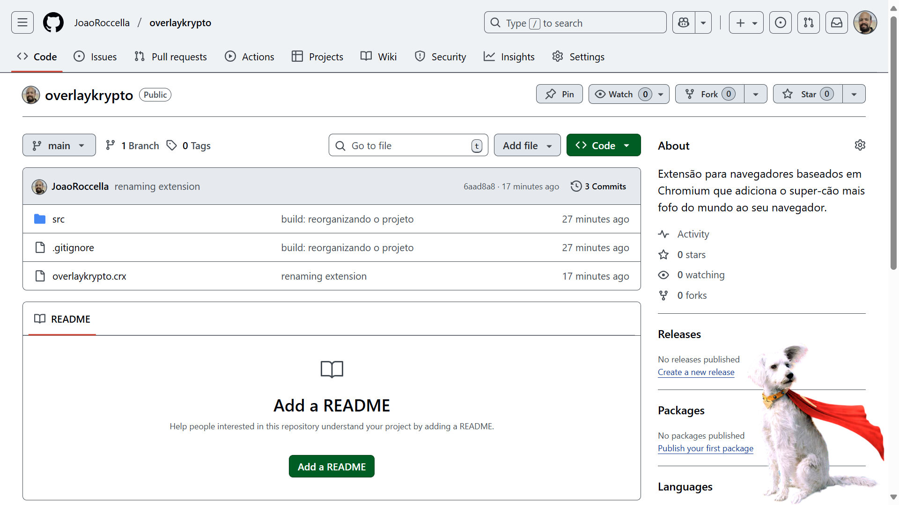

# Overlay Krypto

O cãozinho mais fofo do mundo no seu navegador.

## Instruções de Instalação

1. Baixe o arquivo `overlaykrypto.crx`
2. Acesse `chrome://extensions/` no Google Chrome ou `edge://extensions/` no Microsoft Edge
3. Ative o "Modo de desenvolvedor" (canto superior direito)
4. Arraste o arquivo `overlaykrypto.crx` para a página de extensões
5. Pronto! O Krypto estará disponível em todas as páginas que você visitar.

Caso queira remover a extensão, basta voltar à página de extensões e clicar no ícone de lixeira ao lado da extensão "Overlay Krypto".

## Instalação sem pacote

1. Clone este repositório ou baixe os arquivos como ZIP e extraia-os.
2. Acesse `chrome://extensions/` no Google Chrome ou `edge://extensions/` no Microsoft Edge
3. Ative o "Modo de desenvolvedor" (canto superior direito)
4. Clique em "Carregar sem compactação" e selecione dentro da pasta onde estão os arquivos extraídos, o diretório `src`.
5. Pronto! O Krypto estará disponível em todas as páginas que você visitar.

Caso queira remover a extensão, basta voltar à página de extensões e clicar no ícone de lixeira ao lado da extensão "Overlay Krypto".

## Licença

Este projeto está licenciado sob a Licença GNU GPLv3. Veja o arquivo [LICENSE](LICENSE) para mais detalhes.